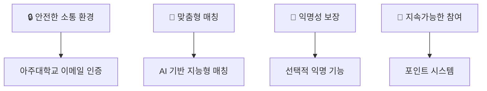
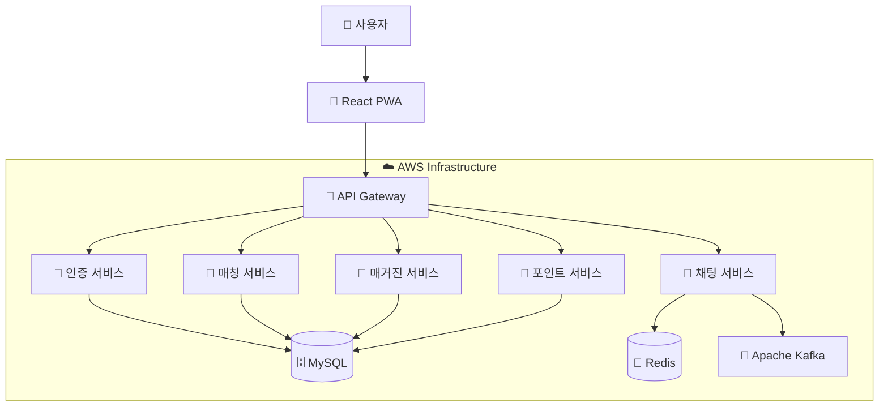
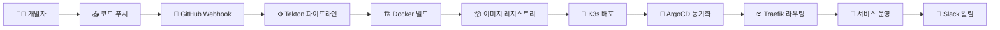

<div align="center">


# 🧠 MindMate
## 아주대학교 학생들을 위한 고민 상담 & 정보 공유 플랫폼

[](https://github.com/capstone-mindmate)
[](https://mindmate.shop)

</div>

---

## 👥 팀원 소개

<div align="center">

**Team: 석지원, 조대희, 권세빈, 한지원**

<table>
<tr>
<td align="center" width="150">
<br/>
<sub><b>👑 석지원</b></sub><br/>
<sub>Infra, Frontend</sub><br/>

</td>
<td align="center" width="150">
<br/>
<sub><b>🔧 조대희</b></sub><br/>
<sub>Backend</sub><br/>
<sub>202020722</sub><br/>
<sub>joedaehui@ajou.ac.kr</sub>
</td>
<td align="center" width="150">
<br/>
<sub><b>💻 권세빈</b></sub><br/>
<sub>Frontend</sub><br/>
</td>
<td align="center" width="150">
<br/>
<sub><b>🎨 한지원</b></sub><br/>
<sub>Backend</sub><br/>
</td>
</tr>
</table>

**지도교수**: 윤대균 교수 | **멘토**: 이준수 (현대오토에버)

</div>

---

## 🎯 프로젝트 소개

<details>
<summary>💡 <b>개발 동기 및 목적</b> 클릭하여 자세히 보기</summary>

| 구분 | 내용 |
|------|------|
| **🎯 Target** | 다양한 고민과 정보를 나누고자 하는 대학교 재학생과 졸업생 |
| **❗ Problem** | 1. 대면 상담의 심리적/물리적 접근성 어려움<br>2. 재학생과 졸업생의 정보 불균형 및 소통 채널 부재<br>3. 익명 커뮤니티의 무책임한 피드백과 낮은 신뢰성 |
| **✅ Solution** | 1. 리스너/스피커 역할 선택 후 수동/랜덤 매칭 기능<br>2. 시간적/공간적 제약 없는 비대면 채팅 상담 기능<br>3. 정보 공유를 위한 매거진 기능<br>4. 포인트 기반 보상 체계로 지속적인 참여 유도 |

</details>

### 🌟 프로젝트 특장점

<div align="center">



</div>

---

## 💻 기술 스택

### 🖥️ Frontend
<div align="center">


</div>

### ⚙️ Backend
<div align="center">


</div>

### 🌐 Infrastructure
<div align="center">


</div>

### 🔒 보안 및 알고리즘
<div align="center">


</div>

---

## 🌳 주요 기능

<div align="center">

| 기능 | 설명                  | 상태 |
|:---:|:--------------------|:---:|
| 🎯 **1:1 매칭 시스템** | 스피커-리스너 간 수동/랜덤 매칭  |  |
| 💬 **실시간 채팅** | WebSocket 기반 실시간 상담 |  |
| 📰 **매거진 공유** | 경험 기반 정보 공유 플랫폼     |  |
| 🎁 **포인트 시스템** | 리워드 기반 참여 유도        |  |
| ⭐ **평가 시스템** | 상호 평가 및 신뢰도 관리      |  |

</div>

### 🔍 핵심 기능 상세

<details>
<summary>🎯 <b>1:1 매칭 시스템</b></summary>

- **수동 매칭**: 사용자가 직접 고민 내용을 작성하고 적합한 사용자 선택
- **랜덤 매칭**: 사용자 특성을 고려한 랜덤 사용자 연결
- **카테고리별 분류**: 학업, 진로, 대인관계, 정신건강, 캠퍼스생활 등

</details>

<details>
<summary>💬 <b>실시간 채팅 상담</b></summary>

- **WebSocket 기반 실시간 통신**
- **이모티콘 및 감정 표현 기능**
- **커스텀폼을 통한 구조화된 상담**
- **메시지 필터링 및 신고 시스템**

</details>

<details>
<summary>📰 <b>매거진 정보 공유</b></summary>

- **경험 기반 정보 공유**: 사용자의 실제 경험을 바탕으로 한 정보 제공
- **카테고리별 분류**: 체계적인 정보 접근 및 검색
- **관리자 검수**: 정보의 질과 신뢰성 보장
- **인기 매거진**: 좋아요 기반 양질의 콘텐츠 추천

</details>

---

## 🏛️ 시스템 아키텍처

<div align="center">



</div>

---

## 🔧 개발 환경 및 협업

### 📋 개발 컨벤션

<div align="center">

| 브랜치 | 용도 | 예시 |
|:---:|:---|:---:|
| `main` | 최종 배포 브랜치 |  |
| `dev` | 주요 개발 브랜치 |  |
| `feat` | 기능 개발 브랜치 |  |

</div>

#### 📝 Commit Convention
```
✨ feat: 새로운 기능 추가
🐛 fix: 버그 수정
📚 docs: 문서 수정
💄 style: 코드 포맷팅
♻️ refactor: 코드 리팩토링
✅ test: 테스트 코드 추가
⚙️ chore: 빌드 업무 수정
```

### 🛠️ 협업 도구

<div align="center">


</div>

---

## 🚀 CI/CD 파이프라인

<div align="center">



</div>

### ⚡ 배포 프로세스
1. **📥 소스 코드 복제** 및 빌드 실행
2. **🐳 도커 이미지 생성** 및 레지스트리 푸시
3. **📝 Kubernetes 매니페스트 업데이트**
4. **🔄 ArgoCD를 통한 자동 배포**
5. **📢 Slack을 통한 배포 결과 알림**

---

## 📊 프로젝트 성과

<div align="center">

</div>

### 🎯 기대효과
- **📈 대학 생활 만족도 향상**: 체계적인 상담 시스템을 통한 학생 복지 증진
- **🤝 졸업생-재학생 네트워크 구축**: 지속가능한 멘토링 생태계 조성
- **🔒 안전한 소통 문화 정착**: 신뢰할 수 있는 대학 커뮤니티 플랫폼 제공
- **💡 정보 격차 해소**: 균등한 정보 접근 기회 제공

---

<div align="center">


**🎓 2025 아주대학교 캡스톤 디자인 프로젝트**


---

**Made with ❤️ by MindMate Team**

</div>
